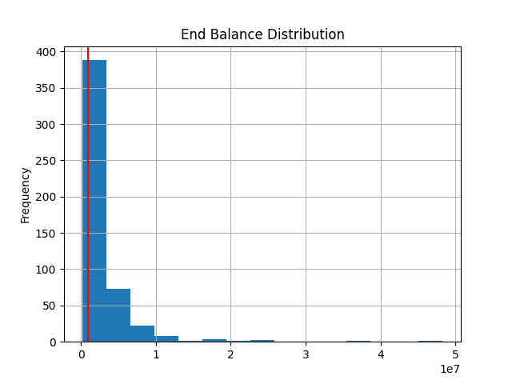
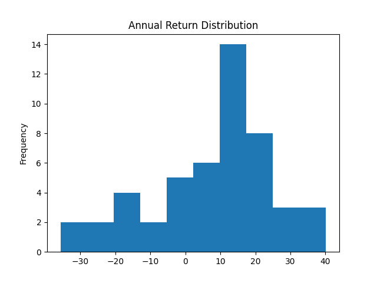
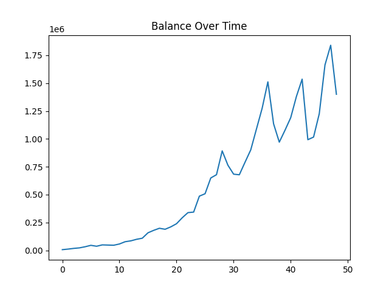

# montecarlo
I wrote this Monte Carlo experiment to calculate the probability of a retirement account reaching $1 Million.

At a high level, this is done by generating many randomized annual returns.
The current balance is multiplied by a return percentage and added (or subtracted for a negative annual return) to make a new balance.
For each year before the retirement age, the calculation with a new random annual return to get the new balance is repeated until the end balance is found.

The experiment is run 500 times and finally, from the 500 end balances, we calculate the success rate where the end balance exceeds $1 Million.

## Data, Assumptions and Disclaimer
The annual return of the S&P-500 index from 1927 until now can be found at [macrotrends.net](https://www.macrotrends.net/2526/sp-500-historical-annual-returns).

Using this data, the average annual return is 7.9% with a standard deviation of 19.

These values are fed into the `numpy.random.normal` method to generate random return values with a Normal distribution.
Better random annual returns can be had with a distribution model that more accurately fits historical S&P-500 returns.

Always remember: Past performance is no guarantee of future results.

**This is a programming exercise and not financial advice.**

## Set-Up
Modern version of [python3](https://www.python.org/downloads/), ie. 3.8 or newer.

## Installation
Set up environment:
```sh
$ git clone <repo url>
$ cd montecarlo
$ mkdir results
$ python3 -m venv .
$ source bin/activate
$ pip install -r requirements.txt
```

## Run
```sh
$ python main.py
```

### Sample Output:
```
====== End Balance Table 500 Runs ======
     start_balance  contribution  end_balance  average_return
0             1000        250000     530956.0        4.860000
1             1000        250000    5340032.0       12.386531
2             1000        250000    4630970.0        9.062449
3             1000        250000     998079.0        4.510000
4             1000        250000     826731.0        7.439388
..             ...           ...          ...             ...
495           1000        250000    1861456.0        9.094082
496           1000        250000    5137429.0       12.177347
497           1000        250000     748437.0        6.220408
498           1000        250000    1839859.0        7.693673
499           1000        250000    2431553.0        7.890612

[500 rows x 4 columns]
====== End Balance Summary Table 500 Runs ======
       start_balance  contribution  end_balance  average_return
count          500.0         500.0        500.0           500.0
mean          1000.0      250000.0    2701162.0             8.0
std              0.0           0.0    3918757.0             3.0
min           1000.0      250000.0     152394.0             1.0
25%           1000.0      250000.0     824622.0             6.0
50%           1000.0      250000.0    1552246.0             8.0
75%           1000.0      250000.0    3082941.0            10.0
max           1000.0      250000.0   48320946.0            16.0
============================================================
Success rate of end balance greater than 1000000: 0.692
```
### Sample End Balance Distribution:



## Features
### Simulation variables
Edit the desired values
```shell script
age = 16
start_balance = 1000
retire_age = 65
annual_contribution = 5000
end_balance_goal = 1000000
```

### View plots for annual return distribution and balance each year
For each rep, the annual return percentage distribution plot can be shown by changing the `view_annual_return_plot` value.
Default `False`

Similarly, the balance of the account can be shown in a line plot by changing the `view_annual_balance_plot`.
This is useful to get a visual of the balance over time.  Default `False`

NOTE: These `num_reps` value should be lowered to `10` or less otherwise each repetition will require manually closing the plot for the experiment to conclude.
```shell script
view_annual_return_plot = True
view_annual_balance_plot = True
```
#### Sample Annual Return Distribution:


#### Sample Balance Over Time:


### Output summary table and plots to disk
Useful if running the experiment in a script, that way the plots and summary table can be examined asynchronously.  The files save to the `results` directory.  Default `False`.
```shell script
output_files = True
```

## Testing
The main components of this Monte Carlo experiment are the randomization of the annual returns and calculation of the balances.

### Annual Return Distribution
The approach to verifying a Normal distribution of the annual return values is to view the Annual Return Distribution histogram plot and verify the summary stats outputted match the mean and standard deviation values set in the program.

Using the `view_annual_return_plot = True` [setting](#view-plots-for-annual-return-distribution-and-balance-each-year), the histogram is shown where we can visually confirm the expected distribution.  

The setting also outputs a summary table to the console, where we can verify the annual return mean, and the standard deviation values
closely matching the parameters passed into the `np.random.normal` method.
```shell script
=== Annual Return Summary Table ===
       annual_return       balance
count      49.000000  4.900000e+01
mean        8.349184  4.197155e+05
std        17.996669  3.763619e+05
min       -26.840000  6.351800e+03
25%        -3.540000  1.204824e+05
50%         5.580000  3.305943e+05
75%        21.380000  6.587142e+05
max        49.410000  1.434930e+06
===================================
```

### End Balance
The balances calculated every year can be verified by the `view_annual_balance_plot = True` [setting](#view-plots-for-annual-return-distribution-and-balance-each-year).  A line graph of the balance over time will be shown to visually check the balances are going up and down as expected.

A way to verify the annual contributions are getting added to the balance, is to set the `annual_contribution` to `0` or a negative value and see how this affects the success rate values.

## Automated Testing
There are two test programs that will parse output files for expected values generated after the simulation is run.
The `output_files = True` [setting](#output-summary-table-and-plots-to-disk), will save to disk, several files that are consumed by the test programs.
A Continuous Integration (CI) job can be built to run these test programs to verify code changes did not unexpectedly affect the simulation results.

### Run
```sh
$ python test_summary.py
$ python test_success_rate.py
```
### test_summary.py
The `allstats.csv` file contains the summary statistics from a run of the simulation.  Running `main.py` 100 times will result in 100 of these files.
The `test_summary.py` program reads every summary statistics file and verifies both the mean and standard deviation of the end balance and average return are within an expected range.

### test_success_rate.py
After each run of the simulation, the success rate is appended to the `success_rate.csv` file.
The success rate's minimum and maximum values are verified to be within an expected range.
I choose to verify the min/smallest and max/largest values rather than the mean so the test more sensitive to changes in the simulation.